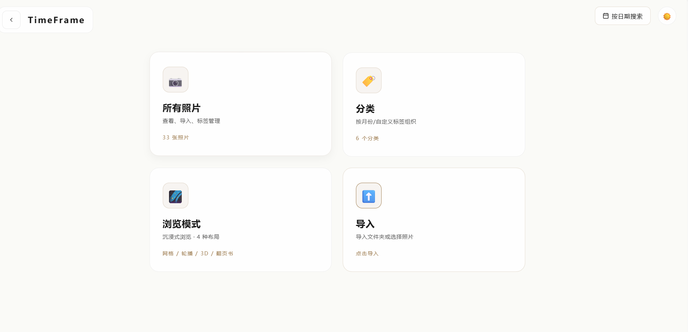
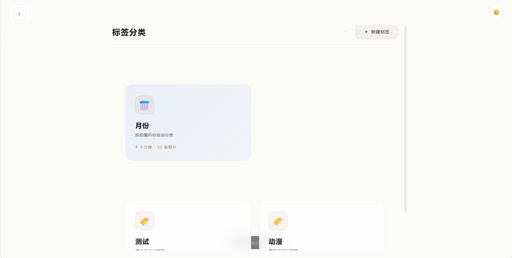
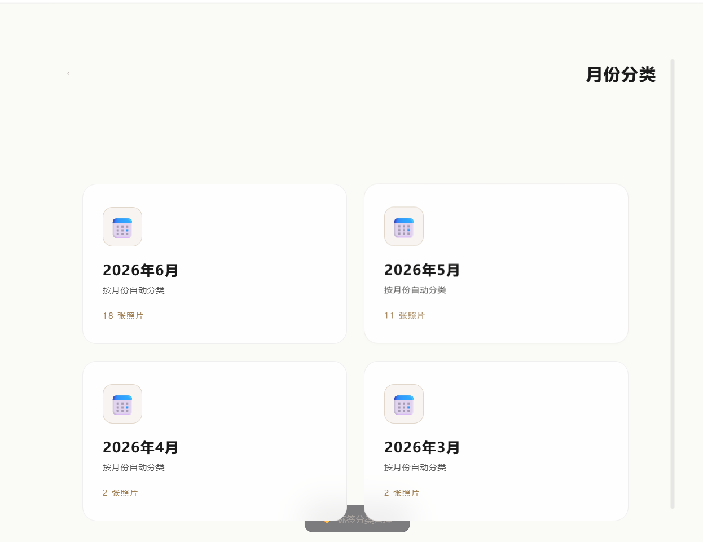
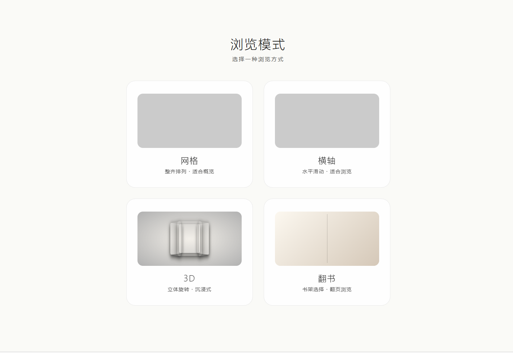
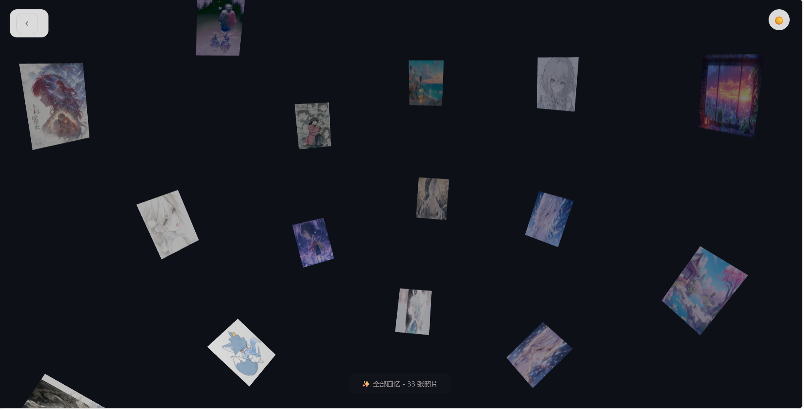
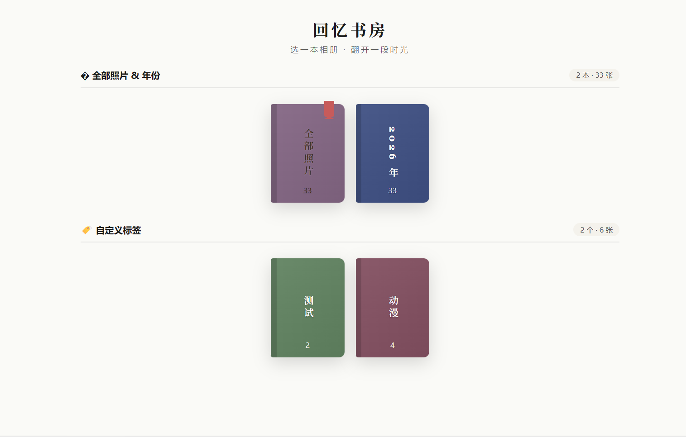

# TimeFrame · 时光相册

> **留住时光的每一帧** — 一个纯前端、零后端的沉浸式本地照片管理与浏览应用

---

## 目录

- [项目介绍](#项目介绍)
- [核心特性](#核心特性)
- [快速开始](#快速开始)
- [使用指南](#使用指南)
- [界面展示](#界面展示)
- [项目结构](#项目结构)
- [技术栈](#技术栈)
- [开发约定](#开发约定)

---

## 项目介绍

**TimeFrame** 是一个完全运行在浏览器中的本地相册应用。它使用浏览器内置的 IndexedDB 进行数据持久化，使用 Blob URL 加载图片，无需任何后端服务即可享受完整的照片管理体验。

无论你是想整理手机里的照片、给回忆分类、还是想要一个富有仪式感的展示方式，TimeFrame 都能满足你。

---

## 核心特性

### 1. 智能导入与自动分类

- **文件夹导入**：选择整个文件夹，递归读取所有图片
- **单/多文件导入**：支持拖拽或点击选择
- **EXIF 自动识别**：自动读取拍摄日期，按月份自动生成系统标签
- **IndexedDB 存储**：所有照片和标签数据持久化在本地

### 2. 多维度标签系统

- **系统月份标签**：根据 EXIF 日期自动生成 `YYYY年MM月` 格式
- **自定义标签**：用户可自由创建/删除（蓝色系标识）
- **多对多关系**：一张照片可拥有多个标签
- **标签管理界面**：分类浏览、批量管理、计数实时更新

### 3. 四种沉浸式浏览模式

| 模式 | 说明 | 适用场景 |
|------|------|----------|
| **网格 Grid** | 平铺瀑布流，紧凑浏览 | 大量照片快速预览 |
| **轮播 Carousel** | 横向 3D 滚动，沉浸展示 | 精选照片展示 |
| **3D Three.js** | 球体 / 螺旋 / 立方 / 波浪 | 主题化炫酷展示 |
| **翻页书 Book** | 双页仿真书，翻页动画 | 怀旧故事化浏览 |

### 4. 模拟书架入口（翻页模式专属）

进入翻页浏览前，呈现一个优雅的书架界面：
- 上层：**月份专辑**（按时间排序）
- 下层：**自定义标签专辑**
- 书本颜色随机，厚度反映照片数量
- 点击书本直接打开对应相册

### 5. 详细照片信息

- 显示 EXIF 元数据（拍摄时间、文件大小等）
- 内联管理标签（添加/移除）
- 大图预览支持

### 6. 黑白双主题

- 一键切换深色 / 浅色主题
- 所有弹窗、标签、按钮均完整适配

---

## 快速开始

### 1. 启动本地服务器

由于使用了 ES Modules 和 IndexedDB，必须通过 HTTP 服务访问。

**Windows 用户**：双击项目根目录下的 `start-server.bat`

**手动启动**：

```bash
# 方式一：Python（推荐，零依赖）
python -m http.server 8000

# 方式二：Node.js
npx http-server -p 8000 --cors
```

### 2. 打开浏览器

访问 **http://localhost:8000**

### 3. 导入第一张照片

1. 在主页点击 **导入** 卡片
2. 选择"导入文件夹"或"导入照片"
3. 等待处理完成（自动提取 EXIF + 生成月份标签）

---

## 使用指南

### 流程概览

```
封面 → 主页 → 导入照片 → 标签管理 / 浏览模式
         ↓
       按日期搜索
```

### 关键操作

#### 1. 导入照片

- 主页 → **导入** 卡片
- 选择文件夹（推荐）或单张/多张照片
- 自动读取 EXIF → 自动创建月份标签 → 自动归档

#### 2. 浏览照片

- 主页 → **所有照片** → 选择布局
- 支持切换：网格 / 轮播 / 3D / 翻页书
- 3D 模式下可选：球体 / 螺旋 / 立方体 / 波浪

#### 3. 翻页模式书架

- 浏览模式 → **翻页书** → 进入书架
- 上层是按月份排列的专辑书
- 下层是自定义标签专辑书
- 点击任意一本书 → 进入对应相册

#### 4. 标签管理

- 主页 → **分类** 卡片
- 浏览 `系统默认 / 月份 / 自定义标签`
- 选中某月 → 浏览该月所有照片
- 在照片详情中可添加/移除标签

#### 5. 按日期搜索

- 主页右上角 → **按日期搜索**
- 选择年/月 → 快速跳转到该月照片

#### 6. 主题切换

- 右上角 🌙 / ☀️ 按钮
- 支持深色 / 浅色无缝切换

---

## 界面展示

### 欢迎页与导入

| 欢迎页 | 导入照片 | 网格视图 |
|:------:|:--------:|:--------:|
|  |  |  |

### 浏览模式

| 轮播视图 | 3D 环形 | 翻页书 |
|:--------:|:-------:|:------:|
|  |  |  |

| 翻书效果 | 3D 手势 |
|:--------:|:-------:|
|  |  |

### 详情与筛选

| 照片详情 | 日历筛选 | 添加照片 |
|:--------:|:--------:|:--------:|
|  |  |  |

---

## 项目结构

```
timeframe_v2/
├── index.html              # 主入口 HTML
├── style.css               # 全局样式（黑白双主题）
├── script.js               # 主逻辑（导入、浏览、主题等）
├── package.json            # 测试依赖（vitest）
├── start-server.bat        # 一键启动脚本
├── src/                    # 模块化源码
│   ├── db.js               # IndexedDB 封装
│   ├── grid-layout.js      # 网格布局
│   ├── carousel-layout.js  # 轮播布局
│   ├── book-layout.js      # 翻页书布局
│   ├── three-mode.js       # 3D 模式
│   └── tag-manager.js      # 标签管理
├── docs/                   # 文档
│   ├── README.md           # 本文件
│   └── screenshots/        # 界面截图
└── .trae/                  # 项目记录
```

---

## 技术栈

- **原生 HTML5 + CSS3 + ES Modules**：零框架
- **Three.js** (CDN)：3D 照片排列
- **EXIF-js** (CDN)：读取照片元数据
- **IndexedDB**：本地持久化
- **Vitest** (dev)：单元测试


---

## 常见问题

**Q: 为什么不能直接打开 index.html？**
A: ES Modules 和 IndexedDB 在 `file://` 协议下不可用，必须通过 HTTP 服务访问。

**Q: 照片会泄露到云端吗？**
A: 不会。所有数据存储在本地 IndexedDB，Blob URL 也仅在内存中。


**Q: 如何彻底清空数据？**
A: 浏览器 DevTools → Application → IndexedDB → 删除 `TimeFrameDB`。

---

## License

MIT

---

<p align="center">
  <sub>Made with care · 留住时光的每一帧</sub>
</p>
